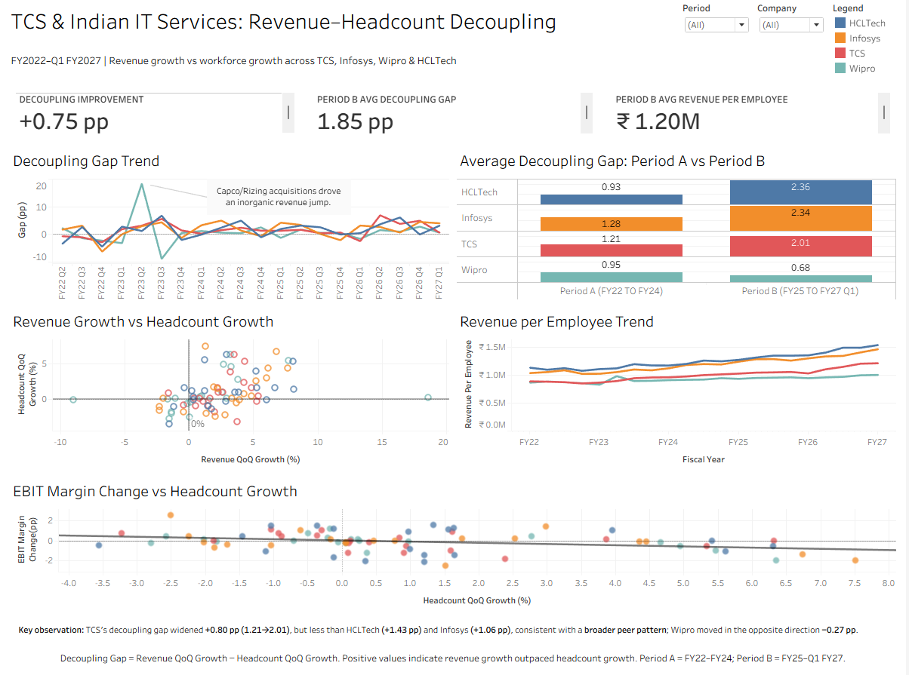

# TCS vs. Peer IT Majors — Revenue, Headcount & Margin Trend Analysis

A data analytics case study examining how the relationship between revenue growth
and workforce growth has changed across four major Indian IT-services companies:
**TCS, Infosys, Wipro, and HCLTech**, from **FY22 through Q1 FY27**.

The project investigates whether revenue is becoming less tightly coupled with
headcount growth and whether this pattern is specific to TCS or visible across
the broader peer group.

The analysis combines quarterly financial, workforce, profitability, and
attrition data with SQL-based transformations and an interactive Tableau
dashboard.

---

## Business Question

**Is TCS decoupling revenue growth from headcount growth faster or slower than
its industry peers, and what does the changing revenue-headcount relationship
signal about the traditional IT-services hiring model?**

Rather than treating AI-driven productivity as a proven explanation, the project
tests whether the underlying revenue and workforce data show evidence of a
changing relationship.

---

## Analytical Scope

### Companies

- **TCS**
- **Infosys**
- **Wipro**
- **HCLTech**

### Study Period

**Q1 FY22 through Q1 FY27**

This represents:

- 21 quarters per company
- 4 companies
- 84 company-quarter observations

### Analytical Periods

| Period | Coverage |
|---|---|
| Period A | FY22–FY24 |
| Period B | FY25–Q1 FY27 |

Period A represents the earlier comparison period, while Period B represents
the later period used to examine whether the revenue-headcount relationship
changed.

---

## Guiding Questions

The analysis addresses five questions:

1. How do revenue, headcount, attrition, and EBIT margin trends compare across
   TCS, Infosys, Wipro, and HCLTech?
2. How did the **decoupling gap** change between Period A and Period B across
   the four companies?
3. Is TCS an outlier, or is the changing revenue-headcount relationship visible
   across the selected peer group?
4. How does **revenue per employee** change across companies and between the
   two analytical periods?
5. Does EBIT margin change show a stronger relationship with headcount growth
   or revenue growth?

---

## Core Metric: Decoupling Gap

The central metric in the project is:

```text
Decoupling Gap =
Revenue QoQ Growth % − Headcount QoQ Growth %
```

A positive decoupling gap means revenue growth outpaced headcount growth during
that quarter. A higher average decoupling gap in Period B indicates greater
separation between revenue growth and workforce growth compared to Period A.

---

## Tools

SQL (PostgreSQL) · Python (pandas, for data validation) · Tableau

## Project Structure
- `docs/` — Ask, Prepare, Process, Analyze, Share, Act documentation
- `data/` — raw source data (`raw/factsheets/`) and processed analytical datasets (`processed/`)
- `sql/` — schema and analysis queries
- `scripts/` — data validation script
- `dashboards/tableau/` — final dashboard workbook (`final/`) and earlier iterations (`archive/`)
- `reports/images/` — exported dashboard visuals

---

## Key Findings
- **TCS is not the strongest "decoupler" among its peers.** Its average
  decoupling gap (revenue QoQ growth % minus headcount QoQ growth %) rose from
  1.21pp in Period A (FY22 TO FY24) to 2.01pp in Period B (FY25 TO FY27 Q1) —
  a real increase, but smaller than HCLTech's (+1.43pp) and Infosys's
  (+1.06pp). Wipro's gap actually narrowed (0.95pp → 0.68pp). The popular
  narrative that TCS is leading an AI-driven productivity shift is only
  partially supported once benchmarked against peers — the shift looks more
  sector-wide than TCS-specific, and where it's happening, TCS isn't the
  front-runner.
- **Margin trends don't track decoupling in a simple way.** TCS held the
  highest EBIT margin of all four companies in both periods (~24.6%,
  essentially flat), while Infosys and HCLTech saw margins decline slightly
  (21.6%→20.8%, 18.4%→17.7%) even as their decoupling gaps widened. Wipro's
  margin improved (16.5%→17.1%) despite the weakest decoupling trend of the four.
- **Attrition fell across all four companies, not just TCS** — TCS
  (16.2%→13.2%), Infosys (20.4%→13.3%), HCLTech (17.8%→12.8%), and Wipro
  (19.2%→14.5%) all show the same cooling pattern, consistent with an
  industry-wide hiring slowdown rather than a company-specific one.
- **Correlation results are mixed and company-specific.** Margin change
  correlates negatively with headcount growth at TCS (-0.35), Infosys (-0.43),
  and Wipro (-0.57). HCLTech is the exception (-0.06) but shows the strongest
  positive correlation between margin and revenue growth (0.67) — its margin
  story looks more top-line-driven than cost-driven. (Based on 20 quarters
  per company — directional, not statistically robust.)

## Dashboard



**Tableau Public:** https://public.tableau.com/shared/SC4DT9NSM?:display_count=n&:origin=viz_share_link

## Author
Krishna Jagtap